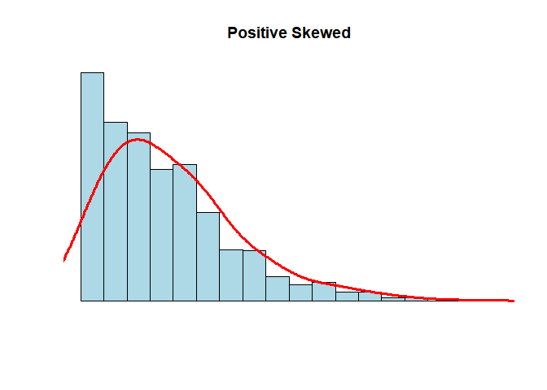
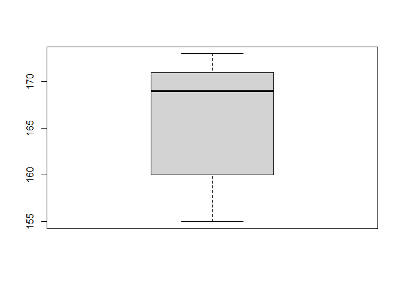
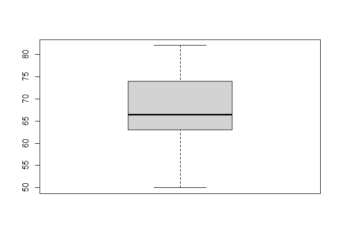

Atividade avaliativa 01
================
Mateus Reis da Silva, Sheilla Santos da Rosa, Nilson </br>
Estat2020.1

------------------------------------------------------------------------

**Questão 01**

**(a)** </br> O erro de Astrobaldo em ter afirmado que a mala mais
pesada era de 23 Kg foi devido o mesmo não ter levado em consideração os
*limites inferiores e limites superiores* conhecidos também como
*bigodes* do grafico boxplot, pois os pesos das malas estão destribuidos
também nos *limites inferiores e superiores*, porém o erro de Astrobaldo
foi não levar em consideração os valores destribuidos dentre esses
limites.

***OS DADOS NUMERICOS ABAIXO SÃO REFERENTES AOS DADOS DO GRAFICO
BOXPLOT***

``` r
x <- c(5, 6, 7, 8, 9, 10, 11, 12, 13, 14, 15, 16, 17, 18, 19, 20, 21, 22, 23, 24, 25, 26, 27, 28, 29) 
```

**(b)** </br> Depois de realizar o cálculo da mediana com os valores
acima, chegou-se ao resultado disposto abaixo.

``` r
median(x)
```

    ## [1] 17

**(c)** </br> Para realizar o cálculo da diferença interquartilica entre
os quartis que representam 75% e 25%, pegou-se o conjunto de dados (X)
disposto acima, e observou-se o seguintes valores dos quartiles.

``` r
quantile(x)
```

    ##   0%  25%  50%  75% 100% 
    ##    5   11   17   23   29

Nesse calculo abaixo, podemos observar a distância interquartilica entre
o terceiro qurtil *75%* que é representada pelo valor *23* e o primeiro
quartil \_ 25%\_ representado pelo valor *11*, para calcular essa
distância utilizou-se as operações básicas, no *R*, dessa forma
possibilitando com que calculasse a diferênca intequartilica.

*Os valores 11 e 23, foram calculados acima, pela variável quantile(X).*

``` r
23 - 11
```

    ## [1] 12

**(d)** </b> Nessa questão é solicitado o calculo dos valores de malas
que pesam igual ou menos de 10 Kg, dessa forma levou-se em consideração
que as 240 malas dispostas na questão seja o total de malas que o
grafíco representa, dessa forma, os valores abaixo do grafico boxplot da
prova demonstra os pesos das malas, com isso se levarmos em consideração
os valores abaixo de 10 kg, pegou a diferença entre os quartis e
multiplicou por 1.5, calculo esse que demonstra a quantidade de malas
com o peso de 10 kg ou menos. Como demonstrado no calculo abaixo.

``` r
1.5 * 12
```

    ## [1] 18

**Questão 02** </br> Nessa questão é solicitado a média aritimética dos
da nota dos 80 alunos, dessa forma, inicialmente colocou-se os dados da
média aritimetica das duas amostras de alunos, e observou-se que
alternativa correta após realizar o calculo é alternativa *d*

``` r
x <- c(6.40, 5.20)
```

``` r
mean(x)
```

    ## [1] 5.8

**Questão 03**

**(a)** </br> Nessa questão, inicialmente foi criado um vetor (X) que
tem como função representar os dados correspondentes aos (Bat/min), que
estão dispostos na questão.

Esse vetor tem como função principal representar os dados agrupados
correspondentes aos (Bat/min), o vetor está representado na sequencia
numeríca avaixo.

``` r
x <- c(68, 70, 72, 58, 90, 110, 68, 70, 72, 80, 80, 67, 90, 94, 100, 80, 75, 79, 84, 90)
```

**(b)** </br> Diante dos valores que representam os (Bat/min)
demonstrados na altrnativa **(a)** ao qual está representado pela
varievel (X) foi possivél cálcular a mediana, média, primeiro quartil,
terceiro quartil e o desvio padrão desses dados, ao qual apresentou
valores que estão dispostos abaixo.

**item-01\_mediana\_** </br> Para calcular a mediana utilizou-se como
base os dados representados pela váriavel (X), que representam os
(BAT/min), para realizar o calculo utilizou-se a função *median*, dessa
forma possibilitando o resultado disposto abaixo.

``` r
median(x)
```

    ## [1] 79.5

**item-02\_média\_** </br> No cálculo abaixo demostra como foi calculado
a média dos dados representados pela variável (X) que representam os
(BAT/min), para realizar esse cálculo utilizou-se a função *mean* e foi
possível obter o resultado reprentado abaixo.

``` r
mean(x)
```

    ## [1] 79.85

**item-03\_Calculo dos quartiles\_** </br> Pegando como base os dados da
variável (X) que representam os (BAT/min) e foi possível analisar os
valores do *PRRIMEIRO QUARTIL, SEGUNDO QUARTIL E TERCEIRO QUARTIL*,
depois de usar a função *quantil*.

*Nesse procedimento foi solicitado apenas o primeiro e terceiro quartil,
mas calculei também o segundo para deixar a resposta por inteiro*

``` r
quantile(x)
```

    ##    0%   25%   50%   75%  100% 
    ##  58.0  70.0  79.5  90.0 110.0

**item-04\_Calculo do Desvio padrão\_** </br> No procedimento abaixo foi
calculado o desvio padrão do conjunto de dados (X) que representa
(BAT/min), para realizar essse procedimento utilizou-se a função *sd*
que representa o desvio padrão, e obteve o resultado abaixo.

``` r
sd(x)
```

    ## [1] 12.78681

**(c)** </br> De acordo com o Histograma a diferença entre a média e
mediana desses dados são pequenas, pois o valor que representa a média é
de 79.85 *item-02* e o valor que representa a mediana é de 79.5
*item-01*, dessa forma é possível notar que os valores da média e
mediana estão representados na mesma coluna no histograma, a coluna que
tem a distância entre os valores 70 à 80. Diante disso pode-se tirar a
analogia de que ambos os valores representam bem o histograma, uma vez
que as diferenças entre os valores são pequenos.

``` r
hist(x)
```

<!-- -->

**Questão 04**

**Questão 05**

O código abaixo tem como função gerar um histograma para analíse.

``` r
#---------------------------------------------------------
N <- 1000
x <- rnbinom(N, 4, .5)
hist(
x,
xlim = c(min(x), max(x)),
probability = T,
nclass = max(x) - min(x) + 1,
col = 'lightblue', xlab = ' ', ylab = ' ', axes = F,
main = 'Positive Skewed'
)
lines(density(x, bw = 1), col = 'red', lwd = 3)
```

<!-- -->

``` r
#---------------------------------------------------------
```

De acordo com o analíse do histograma, a medida de tendência central que
mais se encaixa nos parametros de escolha para analíse desse grafico é a
*mediana*, pois a média ela é muito sensível a valores extremos, o que
acomete em deslocalizações extremas para representações grafica. Já a
mediana por ser o valor de observação intermediaria ela sofre
deslocamento de menores proporções, em relação aos valores extremos.
Dessa forma concui-se que a média é mais sensível a valores extremos, e
podem vim acometer o resultado final, do outro lado temos a mediana que
se apresenta de maneira mais relevante para essas medidas, uma vez que,
a mesma não sofre grandes ossilações de valores quando leva-se em
consideração os valores extremos.

**Questão 06**

**Questão 07**

**(a)** </br> Nessa alternativa, foi criada uma tibble que representa a
tabela disposta na atividade, como solicitado a tibble correspondente se
encontra abaixo.

``` r
tabela_01 <- tribble(
  ~nome, ~altura, ~peso,
  "Ana", 155, 50,
  "Ludimilla", 158, 61,
  "Cristina", 162, 65,
  "Tereza", 168, 68,
  "Patrícia", 170, 69,
  "Mariana", 170, 65,
  "Ana Paula", 172, 82,
  "Dirce", 173, 79) 
tabela_01 %>% view()
```

**(b)** </br> Nessa alternativa foi solicitado para classificar as
variáveis envolvidas na tibble, as variáveis *peso e altura* são
variáveis *Quantitativas continua*, ou seja, que podem ser medidas em
valores quebrados, que contenham pontos ou virgulas.

**(c)** </br> Nessa alternativa para realizar os calculos, foi gerado um
vetor com a variavel (altura e peso), para facilitar os calculos de
média, mediana e desvio padrão.

Vetor criado com a variável (altura).

``` r
altura <- c(155, 158, 162, 168, 170, 170, 172, 173)
```

Nesse procedimento abaixo, colculou-se a Mediana com a variável altura.

``` r
median(altura)
```

    ## [1] 169

Utilizando os valores da variável altura nesse procedimentou,
calculou-se a Média.

``` r
mean(altura)
```

    ## [1] 166

Nesse procedimento, calculou-se o Desvio Padrão dos dados dispostos na
variável altura.

``` r
sd(altura)
```

    ## [1] 6.78233

Para calcular a média, mediana e desvio padrão, dos pesos, foi
necessario gerar um novo vetor com a variavel (peso), com intuito que os
calculos fiquem de maneira organizada.

``` r
peso <- c(50, 61, 65, 68, 69, 65, 82, 79)
```

Calculo da mediana dos dados dispostos no vetor acima, que tem como
variavel (peso).

``` r
median(peso)
```

    ## [1] 66.5

Nesse procedimento, calculou-se a média do agrupamento de dados da
variável peso.

``` r
mean(peso)
```

    ## [1] 67.375

Desvio padrão, esse procedimento foi realizado com os dados dispostos no
agrupamento de números da variável altura.

``` r
sd(peso)
```

    ## [1] 10.04188

**(d)** </br> Nessa alternativa é solicitado a criação de um grafico
plot.

Para poder gerar o grafíco plot foi necessárrio estipular as variáveis
envolvidas em ambos grafícos, para montar o primeiro boxplot utilizou-se
os conjuntos de números com a variável altura.

``` r
altura <- c(155, 158, 162, 168, 170, 170, 172, 173)
```

Grafico boxplot que corresponde aos valores que representam a variável
altura:

``` r
boxplot(altura) 
```

<!-- -->

Para poder gerar o grafíco boxplot com a variável peso, foi preciso
criar um vetor com a variável peso, para agrupar os dados e assim gerar
o grafíco.

``` r
peso <- c(50, 61, 65, 68, 69, 65, 82, 79)
```

Grafíco boxplot que corresponde aos valores que representam a variável
peso:

``` r
boxplot(peso)
```

<!-- -->
